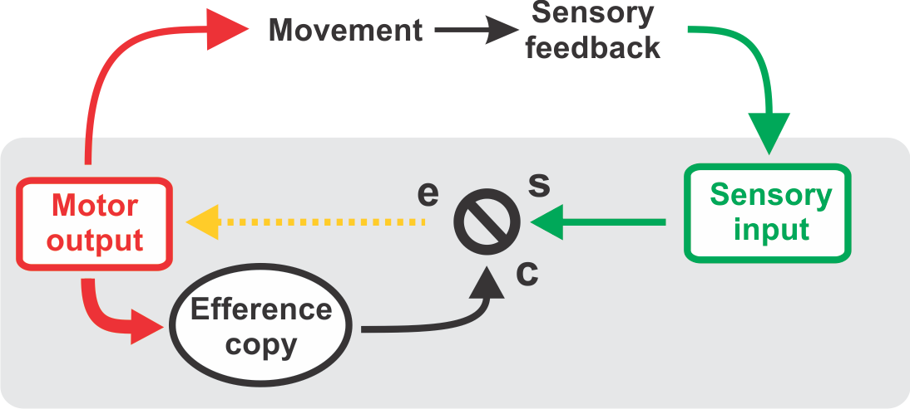

# PredyNet
Predictive coding-inspired neural network models

The spirit of this project is to experiment with neural network implementations of predictive coding (Rao & Ballard, 1999). Predictive coding is an influential theory in cognitive neuroscience, but at the moment remains relatively unexplored at the level of systems neuroscience. 

## Predictive Coding

In essence, predictive coding is just control theory (albeit also generalized to non-sensorimotor domains): 

#####  Adapted from Keller & Hahnloser, 2009

The underlying idea here points to a simple generative model: a "latent variable" layer, let's call it Y, tries to predict the state of the world X via a reconstruction matrix V. The layer receives as input its own prediction error in an online manner. These two-way dynamics mean that even without weight updates, Y can follow its input. This renders the architecture related to Kalman filters and similar Bayesian methods. 

We can easily find a learning rule that reflects the statistics of the environment that Y wants to predict. 

However, the ultimate goal here isn't just to follow an arbitrarily complex input. 

The idea is that at all levels our interaction with the world is a closed loop: every action we take influences our environment, and it in turn influences our sensory input. We can use this feedback in order to learn better motor strategies and to quickly react to unexpected perturbations. Now, of course, for this scheme to make any sense there must be a prediction involved. In these 
